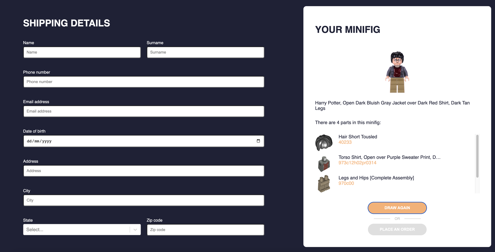
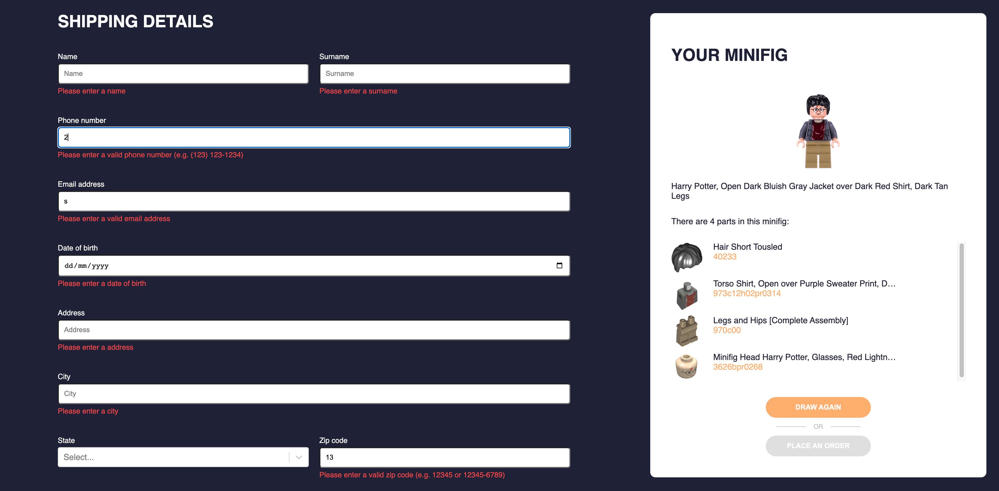

# LEGO Minifigs

Simple application that allows users to order LEGO mini figures from the Harry Potter series.


## Table of contents
* [General info](#general-info)
* [Technologies](#technologies)
* [Screenshots](#screenshots)
* [Setup](#setup)

<a name="general-info"></a>
## General info

The application was created according to a specification in <a href="./frontend-minifigs.pdf">this file</a>.

<a name="technologies"></a>
## Technologies

The project is created with:
* `typescript` (v4.7.4)
* `react` (v18.2.0)
* `axios` (v0.27.2) - to connect with external api
* `formik` (v2.2.9) - to build form
* `react-i18nify` (v4.6.1) - for translations
* `react-select` (v5.4.0) - for select input control with advanced features
* `react-toastify` (v9.0.8) - for toast messages
* `styled-components` (v5.3.5) - for styling (css-in-js)
* `yup` (v032.11) - to validate form data

<a name="screenshots"></a>
## Screenshots

### Empty Form
</img>

### Validation errors
</img>

### Completed Form
</img>

<a name="setup"></a>
## Setup

At first you need to create `.env` file in a root directory of the project. Copy the contents of the `.env.example` file to `.env` file. Then you need to get your own keys for used APIs and also add them to the `.env` file.

### Rebrickable API

Create an account on https://rebrickable.com/ website. After that you can generate an API key in Profile Settings -> API. The key should be added to the `.env` file as a `REACT_APP_REBRICKABLE_API_KEY` variable.

### Rapid API

Create an account on https://rapidapi.com/ website. Go to the US States API docs https://rapidapi.com/aptitudeapps/api/us-states/, copy your **X-RapidAPI-Key** and paste it to the `.env` file to a `REACT_APP_STATES_API_KEY` variable.

### Run the project

After creating your API keys you can run the project. To do it, install the project locally using npm:

```bash
npm install
npm start
```

### Other useful commands

* `npm run storybook` - to run storybook
* `npm test` - to run tests
* `npm run lint` - to run eslint
* `npm run lint:fix` - to fix eslint errors
* `npm run format` - to run prettier and format code
