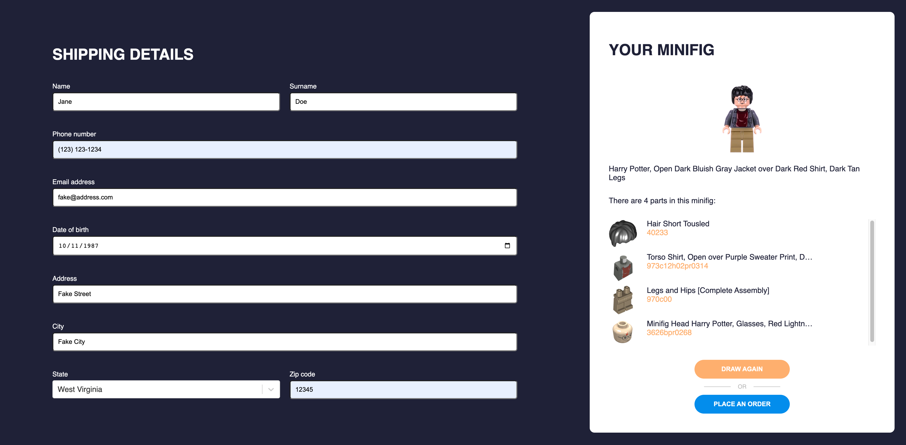

# LEGO Minifigs

Simple application that allows users to order LEGO mini figures from the Harry Potter series.


## Table of contents
* [General info](#general-info)
* [Technologies](#technologies)
* [Screenshots](#screenshots)
* [Setup](#setup)

<a name="general-info"></a>
## General info

The application was created according to a specification in <a href="./frontend-minifigs.pdf">this file</a>.

<a name="technologies"></a>
## Technologies

The project is created with:
* ...

<a name="screenshots"></a>
## Screenshots

### Empty Form


### Validation errors


### Completed Form


<a name="setup"></a>
## Setup

To run this project, install it locally using npm:

```bash
npm install
npm start
```

### Other useful commands

* `npm run storybook` - to run storybook
* `npm test` - to run tests
* `npm run lint` - to run eslint
